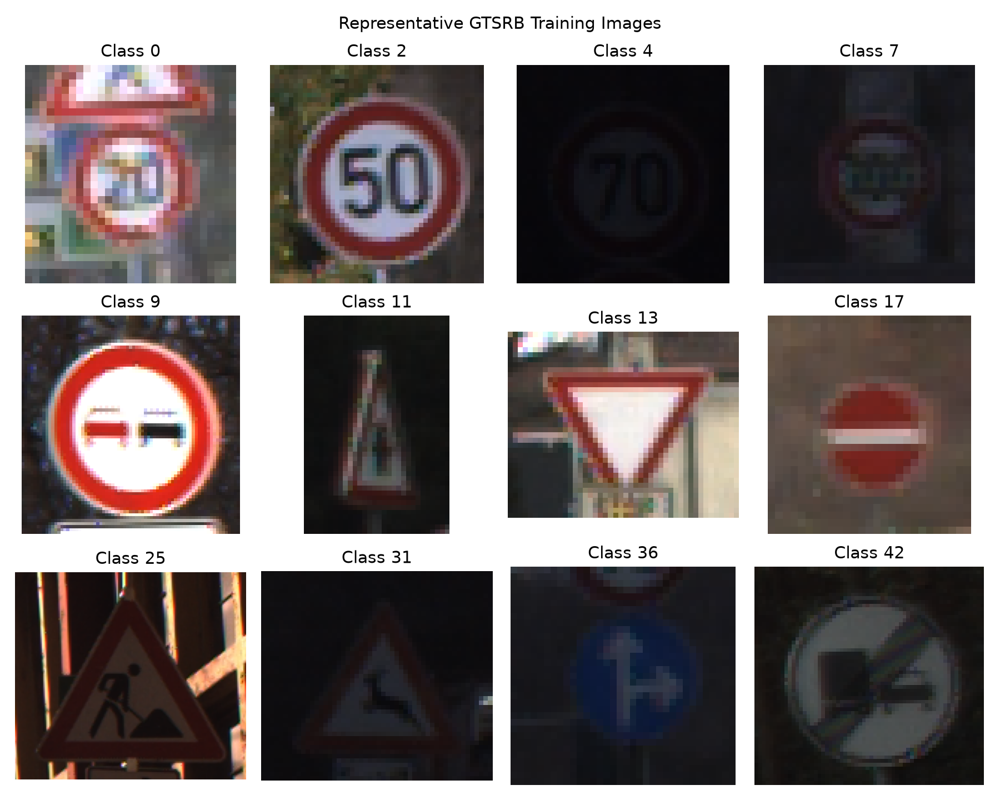
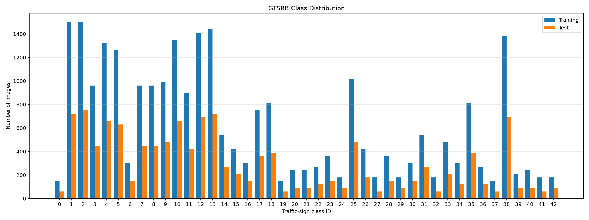
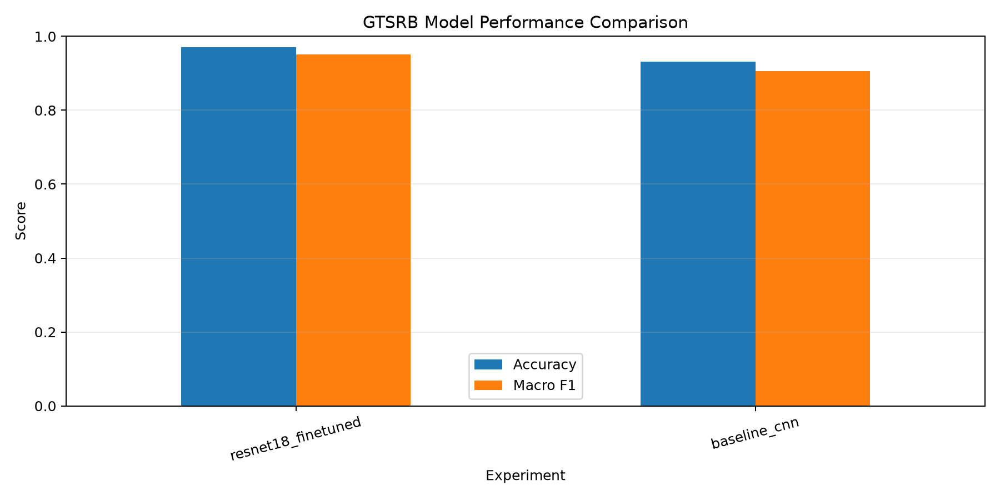
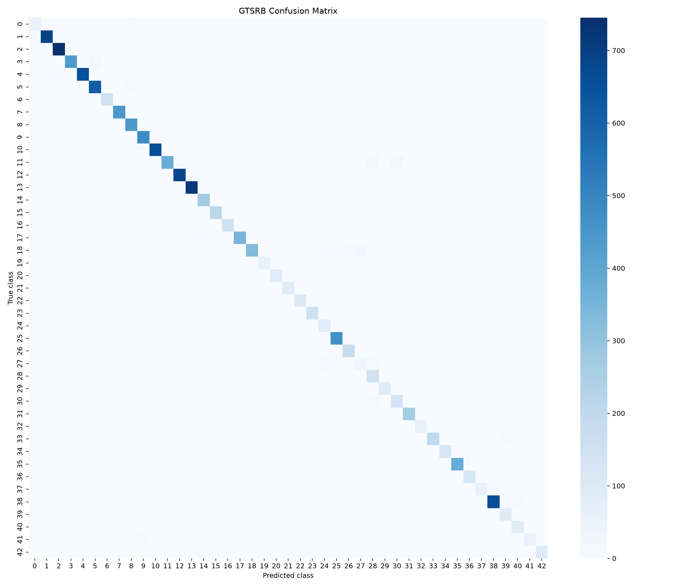
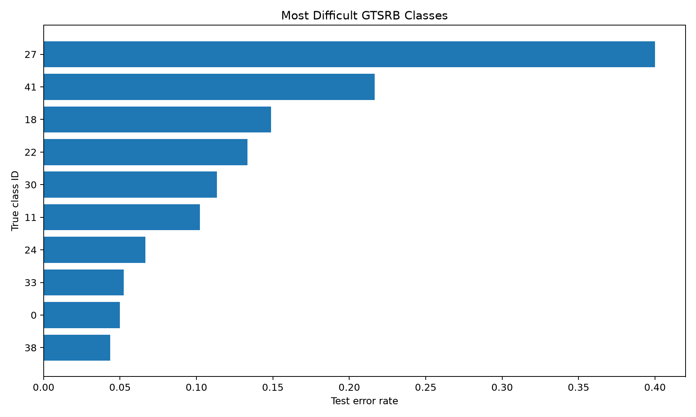

# Traffic Sign Recognition for Driver Assistance Using Convolutional Neural Networks and ResNet-18

**Student:** Bindu Thotakura  
**Course:** COMP-671 Deep Learning  
**Project:** Deep Learning Final Project  
**Date:** October 2026

---

## Abstract

Traffic-sign recognition is an important computer-vision task in driver-assistance and autonomous-driving systems. This project developed and evaluated deep learning models for classifying road-sign images from the German Traffic Sign Recognition Benchmark (GTSRB). The system receives a traffic-sign image and predicts one of 43 sign categories.

A convolutional neural network trained from scratch served as the baseline. The primary model was an ImageNet-pretrained ResNet-18 that was fine-tuned on GTSRB. A controlled ablation experiment was also performed to measure the effect of image augmentation.

The baseline CNN achieved 93.18% test accuracy and a macro F1-score of 90.58%. Fine-tuned ResNet-18 with augmentation achieved the best performance, with 97.03% accuracy and a macro F1-score of 95.08%. ResNet-18 without augmentation achieved 95.54% accuracy and a macro F1-score of 93.12%. These results show that transfer learning substantially improved classification performance and that data augmentation improved ResNet-18 generalization.

Failure analysis found 375 incorrect predictions among 12,630 test examples. Eighty-one incorrect predictions had confidence values of at least 90%, demonstrating that high model confidence does not guarantee correctness. The hardest class was class 27, Pedestrians, with a 40% error rate. The results demonstrate the value of transfer learning while also showing important limitations that must be addressed before real-world deployment.

---

## 1. Introduction

Traffic signs communicate regulations, warnings, directions, and road conditions to drivers. Recognizing these signs automatically is an important capability for advanced driver-assistance systems and autonomous vehicles. A traffic-sign recognition system must handle changes in illumination, image resolution, viewing angle, weather, sign size, and partial obstruction.

This project investigates supervised image classification using convolutional neural networks. The task is to classify a cropped traffic-sign image into one of 43 GTSRB classes. The project compares a small convolutional neural network trained from scratch against ResNet-18 with transfer learning.

The primary research questions are:

1. How accurately can a baseline CNN classify GTSRB traffic signs?
2. Does an ImageNet-pretrained ResNet-18 outperform the baseline CNN?
3. Does image augmentation improve ResNet-18 generalization?
4. Which traffic-sign classes are most difficult to classify?
5. What types of errors remain even when overall test accuracy is high?

The project includes dataset exploration, preprocessing, deterministic data splitting, model training, checkpoint selection, evaluation, ablation analysis, failure analysis, and a single-image inference demonstration.

---

## 2. Dataset

The project uses the German Traffic Sign Recognition Benchmark, or GTSRB. GTSRB is a widely used traffic-sign classification dataset containing real road-sign images captured under varying conditions.

The dataset used through `torchvision.datasets.GTSRB` contained:

| Dataset property | Value |
| --- | ---: |
| Training images | 26,640 |
| Official test images | 12,630 |
| Number of classes | 43 |
| Smallest training class | 150 images |
| Largest training class | 1,500 images |
| Input channels | 3 RGB channels |

The difference between the smallest and largest classes shows that the dataset is imbalanced. For this reason, macro F1-score was evaluated in addition to overall accuracy. Macro F1 gives equal importance to every class, regardless of the number of examples in that class.



**Figure 1.** Example traffic-sign images from GTSRB.



**Figure 2.** Distribution of training and test images across GTSRB classes.

---

## 3. Experimental Protocol

### 3.1 Data Splitting

The official GTSRB test set was preserved for final evaluation and was not used during training or validation.

The original training set was divided into:

- 85% training data
- 15% validation data

The split was generated with random seed 42. The same deterministic indices were used for all experiments, allowing a controlled comparison between models.

The resulting training subset contained approximately 22,644 images. The remaining training images formed the validation subset.

### 3.2 Image Preprocessing

All images were:

1. Converted to RGB.
2. Resized to 64 by 64 pixels.
3. Converted to PyTorch tensors.
4. Normalized using GTSRB channel statistics.

The normalization values were:

```text
Mean: (0.3403, 0.3121, 0.3214)
Standard deviation: (0.2724, 0.2608, 0.2669)
```

Normalization places channel values on more consistent scales and supports stable optimization.

### 3.3 Data Augmentation

For experiments with augmentation enabled, the training pipeline applied:

- Random rotations up to 10 degrees
- Random translations up to 8%
- Random scaling between 90% and 110%
- Brightness variation
- Contrast variation
- Saturation variation

Augmentation was applied only to training images. Validation and test images used deterministic resizing and normalization.

These transformations simulate realistic variation while preserving the meaning of the traffic sign. Horizontal flipping was not used because flipping a directional sign could change its semantic meaning.

---

## 4. Models

### 4.1 Baseline Convolutional Neural Network

The baseline model was trained from scratch. It contained three convolutional feature-extraction blocks.

The feature extractor used:

- A 3-to-32-channel convolution
- Batch normalization
- ReLU activation
- Max pooling
- A 32-to-64-channel convolution
- Batch normalization
- ReLU activation
- Max pooling
- A 64-to-128-channel convolution
- Batch normalization
- ReLU activation
- Adaptive average pooling

The classifier used:

- Flattening
- Dropout with probability 0.35
- A fully connected layer with 256 units
- ReLU activation
- Dropout with probability 0.25
- A final 43-class output layer

The baseline provides a meaningful reference for measuring the value of transfer learning.

### 4.2 ResNet-18 Transfer Learning

The primary model was ResNet-18 initialized with ImageNet-pretrained weights. Its original classification layer was replaced by a linear layer with 43 outputs.

ResNet architectures use residual connections that allow information and gradients to move through shortcut paths. These connections make deeper networks easier to optimize.

All ResNet-18 layers were fine-tuned rather than permanently freezing the pretrained backbone. Fine-tuning allowed the pretrained visual features to adapt to the shapes, borders, symbols, and colors found in traffic signs.

---

## 5. Training Procedure

All models were trained using:

- Cross-entropy loss
- AdamW optimization
- Validation-loss checkpoint selection
- Early stopping
- Random seed 42

### 5.1 Baseline Configuration

| Setting | Value |
| --- | ---: |
| Model | Baseline CNN |
| Batch size | 64 |
| Maximum epochs | 15 |
| Learning rate | 0.001 |
| Weight decay | 0.0001 |
| Augmentation | Enabled |
| Early-stopping patience | 4 |

### 5.2 ResNet-18 Configuration

| Setting | Value |
| --- | ---: |
| Model | ResNet-18 |
| Pretrained weights | ImageNet |
| Batch size | 64 |
| Maximum epochs | 10 |
| Learning rate | 0.0001 |
| Weight decay | 0.0001 |
| Augmentation | Enabled |
| Early-stopping patience | 3 |

### 5.3 Augmentation Ablation Configuration

The ablation used the same ResNet-18 settings as the primary experiment. The only experimental change was disabling augmentation.

| Setting | Augmented ResNet | Ablation ResNet |
| --- | ---: | ---: |
| Seed | 42 | 42 |
| Image size | 64 | 64 |
| Batch size | 64 | 64 |
| Validation fraction | 0.15 | 0.15 |
| Pretrained | Yes | Yes |
| Fine-tuned | Yes | Yes |
| Maximum epochs | 10 | 10 |
| Learning rate | 0.0001 | 0.0001 |
| Weight decay | 0.0001 | 0.0001 |
| Early-stopping patience | 3 | 3 |
| Augmentation | Yes | No |

This controlled design makes it possible to attribute the observed difference primarily to augmentation.

### 5.4 Checkpoint Selection

After every epoch, the pipeline measured validation loss and accuracy. Whenever validation loss improved, it saved a checkpoint containing:

- Model parameters
- Experiment configuration
- Epoch number
- Validation loss

After training, the best checkpoint was restored for final test evaluation. This prevented the test result from depending only on the last training epoch.

---

## 6. Evaluation Metrics

### 6.1 Accuracy

Accuracy is the proportion of test examples classified correctly:

```text
Accuracy = Correct predictions / Total predictions
```

Accuracy provides a clear overall measurement but can hide weak performance on classes with fewer examples.

### 6.2 Macro F1-Score

The F1-score combines precision and recall. Macro F1 calculates an F1-score independently for each class and then averages across all classes.

Because every class receives equal weight, macro F1 is useful for this imbalanced dataset.

### 6.3 Additional Evaluation Artifacts

For each experiment, the project generated:

- Training and validation history
- Test predictions
- Confidence scores
- Per-class classification report
- Confusion matrix
- Accuracy
- Macro F1-score
- Best epoch
- Best validation loss

---

## 7. Results

### 7.1 Overall Results

| Experiment | Test accuracy | Macro F1 | Best epoch | Best validation loss |
| --- | ---: | ---: | ---: | ---: |
| Baseline CNN | 0.9318 | 0.9058 | 15 | 0.01849 |
| ResNet-18 without augmentation | 0.9554 | 0.9312 | 6 | 0.00675 |
| ResNet-18 with augmentation | **0.9703** | **0.9508** | 9 | **0.00371** |

Expressed as percentages:

| Experiment | Test accuracy | Macro F1 |
| --- | ---: | ---: |
| Baseline CNN | 93.18% | 90.58% |
| ResNet-18 without augmentation | 95.54% | 93.12% |
| ResNet-18 with augmentation | **97.03%** | **95.08%** |



**Figure 3.** Comparison of test accuracy and macro F1 across the three experiments.

### 7.2 Baseline CNN

The baseline CNN achieved:

- Test accuracy: 93.18%
- Macro F1-score: 90.58%
- Best epoch: 15
- Best validation loss: 0.01849

This result demonstrates that a relatively small CNN can learn strong traffic-sign features from the available training data.

However, the difference between accuracy and macro F1 indicates that performance was weaker for some less frequent or more difficult classes.

### 7.3 Fine-Tuned ResNet-18

Fine-tuned ResNet-18 with augmentation achieved:

- Test accuracy: 97.03%
- Macro F1-score: 95.08%
- Best epoch: 9
- Best validation loss: 0.00371

Compared with the baseline, ResNet-18 improved:

- Accuracy by approximately 3.85 percentage points
- Macro F1 by approximately 4.50 percentage points

The larger macro-F1 improvement indicates that transfer learning helped performance across classes rather than only improving the most common classes.



**Figure 4.** Confusion matrix for fine-tuned ResNet-18.

---

## 8. Augmentation Ablation

ResNet-18 without augmentation achieved:

- Test accuracy: 95.54%
- Macro F1-score: 93.12%
- Best epoch: 6
- Best validation loss: 0.00675

ResNet-18 with augmentation achieved:

- Test accuracy: 97.03%
- Macro F1-score: 95.08%

Augmentation improved:

- Accuracy by approximately 1.49 percentage points
- Macro F1 by approximately 1.96 percentage points

The augmented model also produced a lower best validation loss. These findings support the conclusion that small geometric and color transformations improved generalization to unseen traffic-sign images.

The non-augmented model obtained very high training accuracy quickly, but its test performance remained below that of the augmented model. This behavior is consistent with augmentation acting as a regularizer and reducing overfitting.

---

## 9. Failure Analysis

The strongest model, fine-tuned ResNet-18 with augmentation, was analyzed using all test predictions.

The failure-analysis summary was:

| Measurement | Value |
| --- | ---: |
| Test examples | 12,630 |
| Correct predictions | 12,255 |
| Incorrect predictions | 375 |
| Error rate | 2.97% |
| Errors with at least 90% confidence | 81 |

Although the overall error rate was low, 81 errors were made with high confidence. Approximately 21.6% of all errors had confidence of at least 90%. This is important for safety-related applications because confidence alone cannot be treated as proof that a prediction is correct.

### 9.1 Most Difficult Classes

| Class ID | Class name | Examples | Errors | Accuracy | Error rate |
| ---: | --- | ---: | ---: | ---: | ---: |
| 27 | Pedestrians | 60 | 24 | 60.00% | 40.00% |
| 41 | End of no passing | 60 | 13 | 78.33% | 21.67% |
| 18 | General caution | 390 | 58 | 85.13% | 14.87% |
| 22 | Bumpy road | 120 | 16 | 86.67% | 13.33% |
| 30 | Beware of ice or snow | 150 | 17 | 88.67% | 11.33% |
| 11 | Right-of-way at next intersection | 420 | 43 | 89.76% | 10.24% |
| 24 | Road narrows on right | 90 | 6 | 93.33% | 6.67% |
| 33 | Turn right ahead | 210 | 11 | 94.76% | 5.24% |
| 0 | Speed limit 20 km/h | 60 | 3 | 95.00% | 5.00% |
| 38 | Keep right | 690 | 30 | 95.65% | 4.35% |



**Figure 5.** GTSRB classes with the highest ResNet-18 test error rates.

Class 27 was the most difficult class by error rate. It also had only 60 test examples, so every mistake had a large effect on its class-level accuracy. Class 18 produced the largest absolute number of errors, with 58 incorrect predictions.

### 9.2 Frequent Confusion Pairs

| True class | Predicted class | Count |
| --- | --- | ---: |
| 11: Right-of-way at next intersection | 30: Beware of ice or snow | 23 |
| 18: General caution | 27: Pedestrians | 22 |
| 11: Right-of-way at next intersection | 28: Children crossing | 20 |
| 3: Speed limit 60 km/h | 5: Speed limit 80 km/h | 15 |
| 1: Speed limit 30 km/h | 0: Speed limit 20 km/h | 12 |
| 41: End of no passing | 9: No passing | 12 |
| 38: Keep right | 40: Roundabout mandatory | 12 |
| 33: Turn right ahead | 39: Keep left | 11 |
| 30: Beware of ice or snow | 28: Children crossing | 11 |
| 38: Keep right | 39: Keep left | 11 |

Several confusion pairs share similar shapes, colors, or sign families. Speed-limit signs differ mainly by small digits, while warning signs often share red triangular borders. Directional signs may also become difficult at low resolution.

Possible causes of errors include:

- Low image resolution
- Motion blur
- Lighting variation
- Similar sign shapes
- Small visual differences between related classes
- Class imbalance
- Partial obstruction
- Background clutter
- Overconfident predictions on unfamiliar image conditions

---

## 10. Single-Image Inference Demonstration

The project includes a command-line inference tool that loads a trained checkpoint, applies deterministic preprocessing, and displays the top predictions.

The demonstration command was:

```bash
python -m src.traffic_sign_recognition.predict \
  data/gtsrb/GTSRB/Final_Test/Images/06578.ppm \
  --checkpoint artifacts/checkpoints/resnet18_finetuned.pt \
  --top-k 3
```

The output was:

```text
1. No passing (class 9): 99.98%
2. No passing for vehicles over 3.5 tons (class 10): 0.00%
3. Vehicles over 3.5 tons prohibited (class 16): 0.00%
```

The inference command demonstrates how the trained model could be integrated into a larger application. It also displays alternative predictions rather than returning only one class.

---

## 11. Reproducibility

The project supports reproducibility through:

- A professor-assigned GitHub repository
- Multiple meaningful Git commits
- Versioned source code
- Dependency files
- YAML experiment configurations
- Random seed 42
- Deterministic train-validation indices
- Separate official test data
- Saved experiment configurations
- Automated tests
- Saved histories and metrics
- Best-checkpoint selection
- Documented commands in the README

The project uses a deterministic split, but exact numerical reproduction across every computer is not guaranteed. PyTorch notes that results can differ across releases, devices, and platforms even when seeds are fixed. The reported experiments were executed using the CPU on macOS.

Large model checkpoints and downloaded datasets are excluded from Git. They can be regenerated by following the README training instructions.

---

## 12. Ethical Considerations

Traffic-sign recognition is safety-related. A wrong classification could contribute to an unsafe driving decision if the output were trusted without verification.

Important ethical and safety concerns include:

- Unequal accuracy across sign classes
- High-confidence incorrect predictions
- Dataset bias toward German traffic signs
- Limited representation of weather and lighting conditions
- Differences between benchmark images and real driving video
- New, damaged, obscured, or modified traffic signs
- Distribution shift across countries and camera systems

The model should not be used as the sole perception component in a real vehicle. A production system would require broader data, uncertainty estimation, continuous monitoring, robustness testing, redundant sensors, and human-centered safety controls.

The project is an educational prototype and does not claim production-level safety.

---

## 13. Limitations

This project has several limitations:

1. Only GTSRB was evaluated.
2. Images were already cropped around traffic signs.
3. The project performs classification, not sign detection.
4. Training and evaluation were based on 64-by-64 images.
5. Only one baseline architecture and one transfer-learning architecture were compared.
6. Experiments used one primary random seed.
7. Calibration was not measured.
8. Robustness to adversarial changes was not tested.
9. Real-time video performance was not evaluated.
10. Results do not establish safe autonomous-driving performance.

Future work should evaluate additional datasets, multiple seeds, model calibration, robustness to corruptions, object detection in full road scenes, inference latency, and deployment on embedded hardware.

---

## 14. Conclusion

This project developed a complete deep learning pipeline for GTSRB traffic-sign classification. It included reproducible dataset splitting, preprocessing, augmentation, model training, early stopping, checkpoint selection, comprehensive evaluation, failure analysis, and single-image inference.

The baseline CNN achieved 93.18% accuracy and a macro F1-score of 90.58%. Fine-tuned ResNet-18 with augmentation achieved the best performance, reaching 97.03% accuracy and a macro F1-score of 95.08%.

The transfer-learning model improved accuracy by 3.85 percentage points over the baseline. The controlled ablation also showed that augmentation improved ResNet-18 accuracy by 1.49 percentage points and macro F1 by 1.96 percentage points.

Despite strong overall performance, failure analysis identified difficult classes and high-confidence errors. These findings show why aggregate accuracy must be accompanied by class-level evaluation and careful safety analysis.

The final result supports fine-tuned ResNet-18 with augmentation as the strongest model tested in this project. However, further validation would be necessary before considering any real driver-assistance application.

---

## References

1. Stallkamp, J., Schlipsing, M., Salmen, J., and Igel, C. (2012). “Man vs. Computer: Benchmarking Machine Learning Algorithms for Traffic Sign Recognition.” *Neural Networks*, 32, 323–332.  
   https://doi.org/10.1016/j.neunet.2012.02.016

2. He, K., Zhang, X., Ren, S., and Sun, J. (2016). “Deep Residual Learning for Image Recognition.” *Proceedings of the IEEE Conference on Computer Vision and Pattern Recognition*, 770–778.  
   https://openaccess.thecvf.com/content_cvpr_2016/html/He_Deep_Residual_Learning_CVPR_2016_paper.html

3. PyTorch Contributors. “GTSRB Dataset.” *torchvision Documentation*.  
   https://docs.pytorch.org/vision/main/generated/torchvision.datasets.GTSRB.html

4. PyTorch Contributors. “Reproducibility.” *PyTorch Documentation*.  
   https://pytorch.org/docs/stable/notes/randomness.html

---

## Appendix A: Important Commands

Run all tests:

```bash
python -m pytest -v
```

Train the baseline:

```bash
python -m src.traffic_sign_recognition.train \
  --config configs/baseline.yaml
```

Train augmented ResNet-18:

```bash
python -m src.traffic_sign_recognition.train \
  --config configs/resnet18.yaml
```

Run the augmentation ablation:

```bash
python -m src.traffic_sign_recognition.train \
  --config configs/resnet18_no_augmentation.yaml
```

Compare experiments:

```bash
python -m src.traffic_sign_recognition.compare
```

Run failure analysis:

```bash
python -m src.traffic_sign_recognition.failure_analysis \
  --predictions artifacts/metrics/resnet18_finetuned/predictions.csv \
  --output-dir artifacts/analysis/resnet18_finetuned
```

Run single-image inference:

```bash
python -m src.traffic_sign_recognition.predict \
  data/gtsrb/GTSRB/Final_Test/Images/06578.ppm \
  --checkpoint artifacts/checkpoints/resnet18_finetuned.pt \
  --top-k 3
```

---

## Appendix B: Repository Artifacts

Important generated artifacts include:

```text
artifacts/metrics/baseline_cnn/
artifacts/metrics/resnet18_finetuned/
artifacts/metrics/resnet18_no_augmentation/
artifacts/analysis/resnet18_finetuned/
artifacts/figures/model_comparison.png
artifacts/figures/class_distribution.png
artifacts/figures/sample_images.png
```